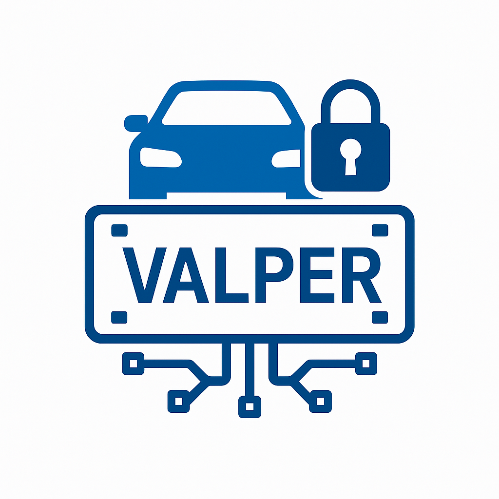
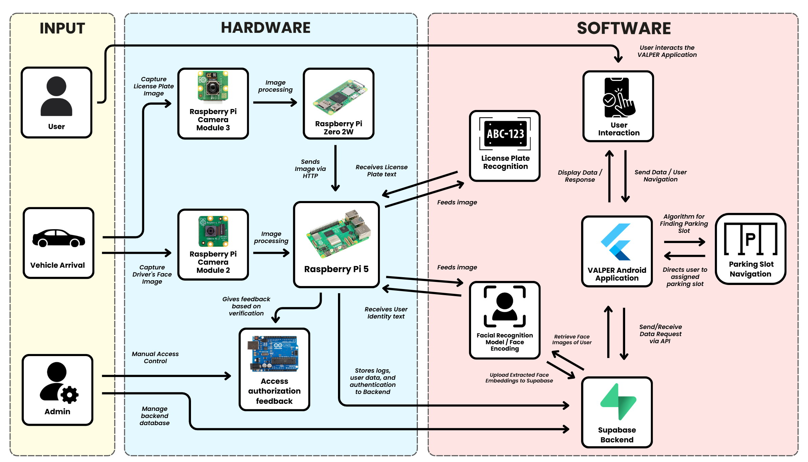

<p align="center">
  
</p>
<h1 align="center"> VALPER System </h1>

<p align="center">
<a href="https://www.python.org/"></a>
<a href="https://flutter.dev/"></a>
<a href="https://supabase.com/"></a>
<a href="https://opencv.org/"></a>
<a href="https://insightface.ai/"></a>
<a href="https://www.raspberrypi.org/"></a>
</p>

<p align="center">
<a href="LICENSE"></a>
<a href="#"></a>
</p>

<p align="center">VALPER is an intelligent identification system built with <b>Python</b> for Raspberry Pi devices, featuring <b>face recognition</b> and <b>license plate recognition (OCR)</b> capabilities. The system uses <b>Supabase</b> for data management and includes a <b>Flutter mobile application</b> for user interaction.</p>

---

## 📋 Table of Contents

- [Overview](#overview)
- [Features](#features)
- [System Architecture](#system-architecture)
- [Project Structure](#project-structure)
- [Prerequisites](#prerequisites)
- [Installation](#installation)
- [Configuration](#configuration)
- [Usage](#usage)
- [Mobile Application](#mobile-application)
- [Contributing](#contributing)
- [License](#license)

## 🎯 Overview

VALPER (Vehicle and Person Recognition) is a comprehensive thesis project that implements an intelligent identification system using computer vision and machine learning. The system combines face recognition and optical character recognition (OCR) technologies to identify and verify vehicles and individuals in real-time.

## ✨ Features

- **Face Recognition**: Real-time face detection and recognition using InsightFace
- **License Plate Recognition**: OCR-based license plate detection and validation
- **Multi-Device Architecture**: Distributed system using Raspberry Pi 5 and Raspberry Pi Zero
- **Service Discovery**: Automatic device discovery using ZeroConf
- **Database Integration**: Supabase backend for data storage and management
- **Mobile Application**: Flutter-based mobile app for system interaction (coming soon)

## 🏗️ System Architecture

<p align="center">
  
</p>

The VALPER system consists of three main components:

1. **Raspberry Pi 5**: Main processing unit handling face recognition, OCR, and license plate validation
2. **Raspberry Pi Zero**: Camera server providing image capture functionality
3. **Flutter Mobile App**: User interface for system interaction and management

## 📁 Project Structure

```
valper-system/
├── src/
│   ├── raspi_scripts/
│   │   ├── raspi_5/
│   │   │   ├── valper_official_v1.py      # Main processing script
│   │   │   ├── OCR_postprocessing_v3.py   # OCR validation and post-processing
│   │   │   └── requirements.txt           # Python dependencies
│   │   └── raspi_zero/
│   │       ├── valper_pizero_v1.py        # Camera server script
│   │       └── requirements.txt           # Python dependencies
│   └── valper_mobile_app/                 # Flutter mobile application (to be uploaded)
├── VALPER_Finalized_compressed.pdf        # Thesis documentation
├── LICENSE                                 # MIT License
└── README.md                               # This file
```

## 🔧 Prerequisites

### Hardware Requirements
- Raspberry Pi 5 (main processing unit)
- Raspberry Pi Zero (camera server)
- Raspberry Pi Camera Module V2
- MicroSD cards for both devices
- Network connectivity (WiFi/Ethernet)

### Software Requirements
- Raspberry Pi OS (64-bit recommended)
- Python 3.8 or higher
- Flutter SDK (for mobile app development)
- Supabase account and project

## 📦 Installation

### Raspberry Pi 5 Setup

1. Clone the repository:
```bash
git clone <repository-url>
cd valper-system
```

2. Navigate to the Raspberry Pi 5 scripts directory:
```bash
cd src/raspi_scripts/raspi_5
```

3. Create a virtual environment (recommended):
```bash
python3 -m venv venv
source venv/bin/activate  # On Windows: venv\Scripts\activate
```

4. Install dependencies:
```bash
pip install -r requirements.txt
```

5. Install additional system dependencies:
```bash
sudo apt-get update
sudo apt-get install -y libgl1-mesa-glx libglib2.0-0
```

### Raspberry Pi Zero Setup

1. Navigate to the Raspberry Pi Zero scripts directory:
```bash
cd src/raspi_scripts/raspi_zero
```

2. Create a virtual environment:
```bash
python3 -m venv venv
source venv/bin/activate
```

3. Install dependencies:
```bash
pip install -r requirements.txt
```

## ⚙️ Configuration

### Environment Variables

Create a `.env` file in the `raspi_5` directory with the following variables:

```env
SUPABASE_URL=your_supabase_url
SUPABASE_SERVICE_KEY=your_supabase_service_key
```

### Model Files

Ensure the ONNX model file is placed at the specified path in `valper_official_v1.py`:
- Default path: `/home/user/my_pi_camera_project/VALPER Python/best.onnx`

### Camera Configuration

The system is configured to use:
- **Raspberry Pi Zero**: Full resolution (3280x2464) with 16:9 crop to 1920x1080
- **Raspberry Pi 5**: Processes images from Pi Zero via HTTP endpoint

## 🚀 Usage

### Starting the Raspberry Pi Zero Camera Server

1. SSH into your Raspberry Pi Zero
2. Navigate to the script directory:
```bash
cd src/raspi_scripts/raspi_zero
```

3. Activate the virtual environment:
```bash
source venv/bin/activate
```

4. Run the camera server:
```bash
python valper_pizero_v1.py
```

The server will start on port 5003 and register itself via ZeroConf for automatic discovery.

### Starting the Raspberry Pi 5 Main System

1. SSH into your Raspberry Pi 5
2. Navigate to the script directory:
```bash
cd src/raspi_scripts/raspi_5
```

3. Activate the virtual environment:
```bash
source venv/bin/activate
```

4. Run the main processing script:
```bash
python valper_official_v1.py
```

The system will:
- Discover the Pi Zero camera server automatically
- Initialize face recognition and OCR models
- Begin processing captured images
- Validate license plates against the database
- Log results to Supabase

## 📱 Mobile Application

The Flutter mobile application source code will be uploaded to `src/valper_mobile_app/` directory. This application will provide:

- User authentication and management
- Real-time system status monitoring
- Database query and management interface
- Configuration and settings management

**Note**: The mobile application code is currently being prepared and will be added to this repository soon.

### Flutter App Setup (Placeholder)

Once the Flutter source code is available:

1. Navigate to the mobile app directory:
```bash
cd src/valper_mobile_app
```

2. Install Flutter dependencies:
```bash
flutter pub get
```

3. Run the application:
```bash
flutter run
```

## 🤝 Contributing

This is a thesis project. For questions or contributions, please contact the project maintainers.

## 📄 License

This project is licensed under the MIT License - see the [LICENSE](LICENSE) file for details.

---

<p align="center">Developed as part of a thesis project</p>
